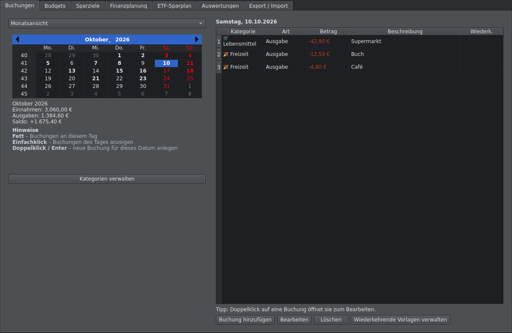
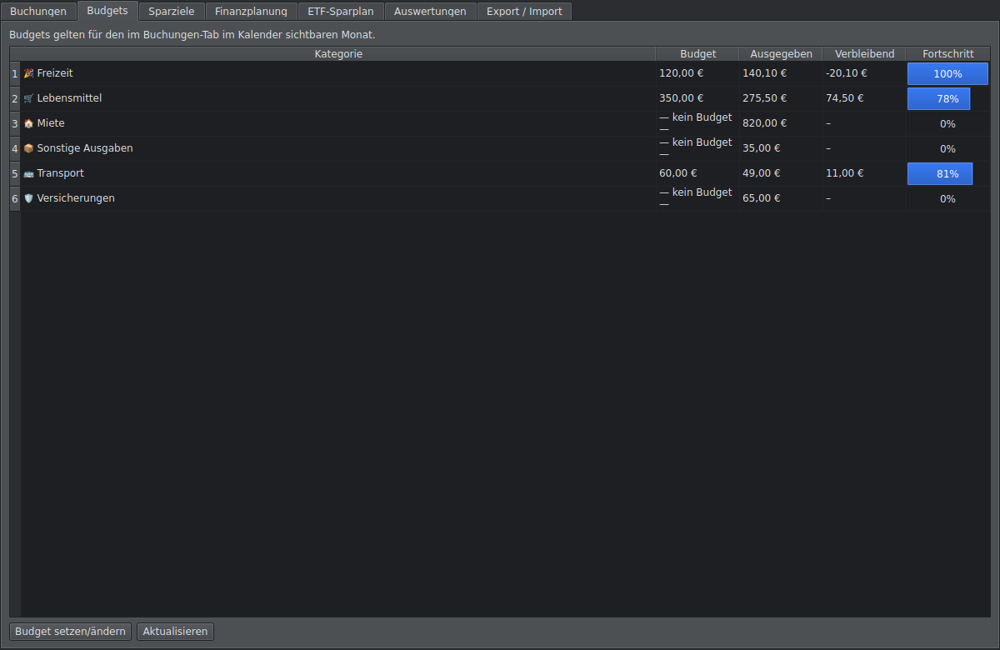
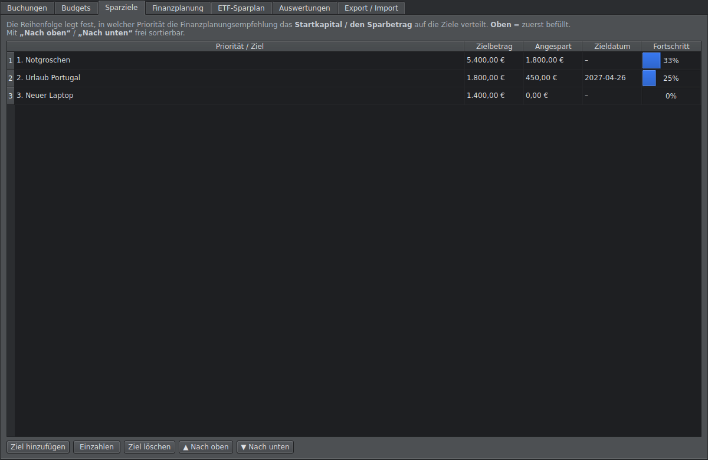
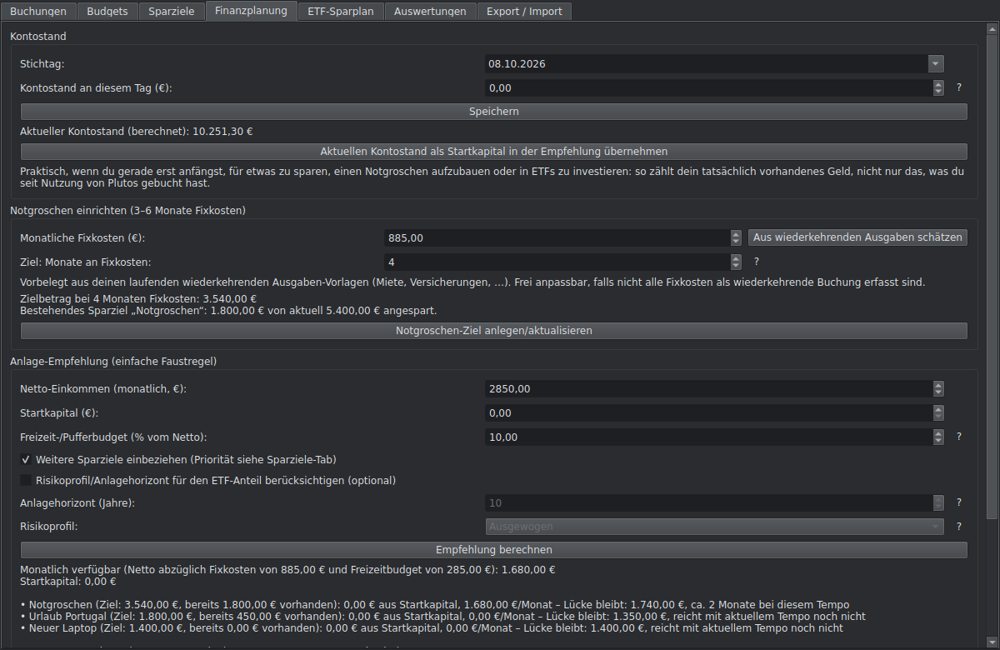
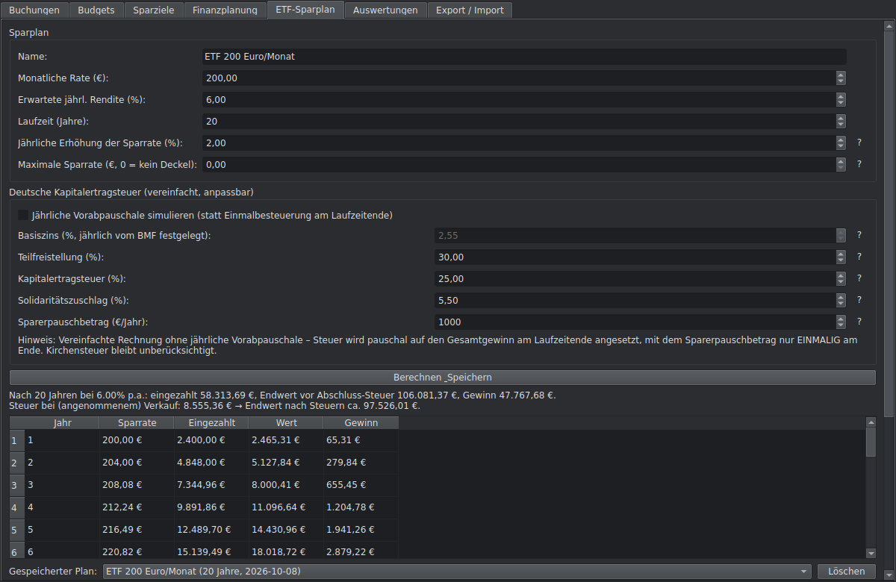
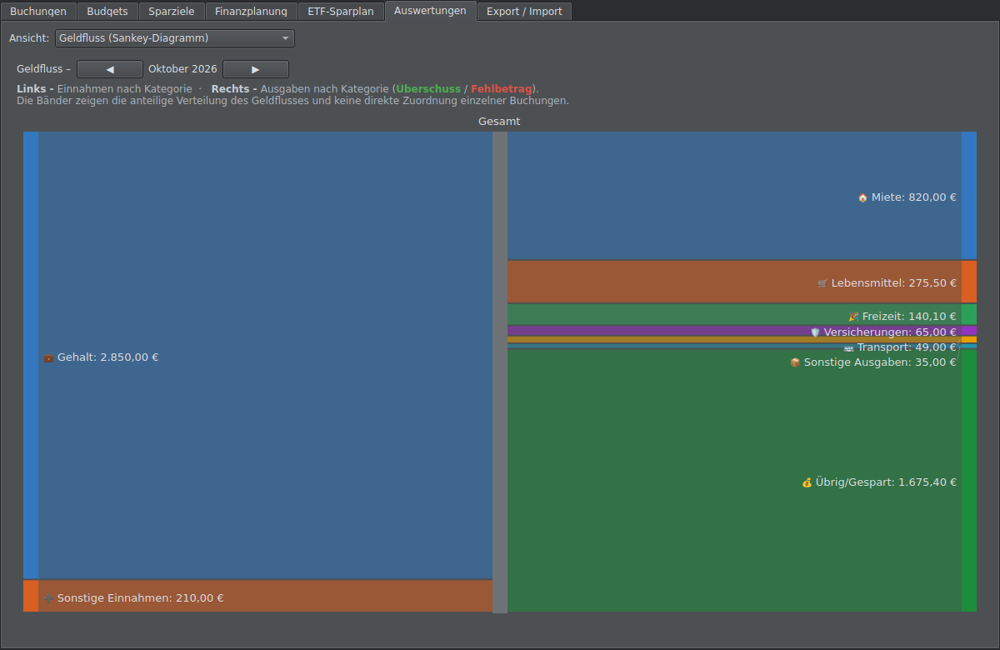
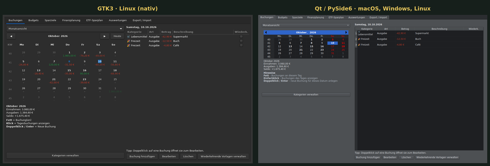

# Plutos – Das Haushaltsbuch

<p align="center">
  
</p>

Plutos ist ein Haushaltsbuch für den Desktop, benannt nach dem griechischen
Gott des Reichtums. Es führt Buchungen wie ein echtes Kontobuch – mit
wiederkehrenden Einträgen, die wirklich wiederkehren, deutscher
Abgeltungsteuer samt Vorabpauschale und einer Finanzplanung, die deinen
tatsächlichen Kontostand kennt.

Plutos ist aus einem einfachen Kalender-Skript für Linux Mint gewachsen und
wurde Stück für Stück ausgebaut – jede Funktion entstand, weil sie im echten
Gebrauch fehlte. Es gibt **zwei unabhängige Oberflächen**, die sich dieselbe
Datenbank-Logik teilen:

| Ordner | Oberfläche | Plattformen |
|---|---|---|
| [`gtk/`](gtk/) | GTK3 | Linux (nativ für Linux Mint/Cinnamon) |
| [`qt/`](qt/) | Qt / PySide6 | macOS, Windows, Linux |

## Funktionen

- **Buchungen** in Monats-, Wochen- und Jahresansicht; Doppelklick auf einen
  Tag legt direkt eine Buchung mit diesem Datum an
- **Wiederkehrende Buchungen**, die unbegrenzt weiterlaufen und sich
  nachträglich bearbeiten lassen – wahlweise nur für die Zukunft oder
  rückwirkend
- **Budgets** pro Kategorie und Monat mit Fortschrittsbalken
- **Sparziele** mit manuell einstellbarer Priorität
- **Finanzplanung**: Kontostand (Startguthaben + Buchungen seitdem),
  Notgroschen-Berechnung aus den laufenden Fixkosten und eine transparente
  Faustregel-Empfehlung zur Aufteilung auf Notgroschen, Sparziele und
  ETF-Sparplan – optional mit Risikoprofil und Anlagehorizont
- **ETF-Sparplan-Rechner** mit steigender Sparrate, deutscher
  Kapitalertragsteuer (Teilfreistellung, Soli, Sparerpauschbetrag) und
  wahlweise jährlicher Vorabpauschale-Simulation, plus Vergleichsdiagramm
  gespeicherter Pläne
- **Auswertungen**: Kreisdiagramm, Trend über mehrere Monate und
  Sankey-Geldfluss-Diagramm
- **Kategorien** mit eigenem Icon, **CSV-/JSON-Export und -Import**
- **„?“-Hilfe-Buttons** neben allen erklärungsbedürftigen Eingabefeldern

## Screenshots

| | |
|---|---|
|  |  |
|  |  |



## GTK und Qt im Vergleich

Beide Oberflächen zeigen dieselben Daten – links GTK (Linux), rechts Qt
(macOS, Windows, Linux):



## Installation

Jede Version bringt eigene Installer-Skripte mit, die die Programmdateien an
einen festen Ort kopieren und einen Starter bzw. Menüeintrag anlegen. Die
Datenbank liegt immer getrennt von den Programmdateien und bleibt bei
Updates und Neuinstallationen unberührt.

**Linux (GTK):** siehe [`gtk/README.md`](gtk/README.md)

```bash
cd gtk
bash install.sh
```

**macOS / Windows / Linux (Qt):** siehe [`qt/README.md`](qt/README.md)

```bash
cd qt
bash install-macos.sh      # macOS
bash install-linux.sh      # Linux
# Windows: install-windows.bat per Doppelklick
```

Eine ausführliche Problembehandlung für alle Plattformen steht in der
[`qt/README.md`](qt/README.md).

## Datenspeicherort

| Plattform | Datenordner |
|---|---|
| Linux | `~/.local/share/plutos/` |
| macOS | `~/Library/Application Support/Plutos/` |
| Windows | `%APPDATA%\Plutos\` |

## Hinweis

Plutos ist ein privates Projekt und **keine Finanzberatung**. Die Steuer- und
Finanzplanungs-Rechner sind vereinfachte Modellrechnungen zur groben
Orientierung. Für verbindliche Entscheidungen bitte eine unabhängige Finanz-
oder Steuerberatung hinzuziehen.

Entwickelt iterativ im Gespräch mit [Claude](https://claude.ai) (Anthropic).
Die Berechnungslogik ist durch automatisierte Funktionstests abgedeckt; alle
Screenshots sind echte Aufnahmen der laufenden App.

## Lizenz

*MIT License
Copyright (c) 2026 dexs-git
Permission is hereby granted, free of charge, to any person obtaining a copy
of this software and associated documentation files (the "Software"), to deal
in the Software without restriction, including without limitation the rights
to use, copy, modify, merge, publish, distribute, sublicense, and/or sell
copies of the Software, and to permit persons to whom the Software is
furnished to do so, subject to the following conditions:
The above copyright notice and this permission notice shall be included in all
copies or substantial portions of the Software.
THE SOFTWARE IS PROVIDED "AS IS", WITHOUT WARRANTY OF ANY KIND, EXPRESS OR
IMPLIED, INCLUDING BUT NOT LIMITED TO THE WARRANTIES OF MERCHANTABILITY,
FITNESS FOR A PARTICULAR PURPOSE AND NONINFRINGEMENT. IN NO EVENT SHALL THE
AUTHORS OR COPYRIGHT HOLDERS BE LIABLE FOR ANY CLAIM, DAMAGES OR OTHER
LIABILITY, WHETHER IN AN ACTION OF CONTRACT, TORT OR OTHERWISE, ARISING FROM,
OUT OF OR IN CONNECTION WITH THE SOFTWARE OR THE USE OR OTHER DEALINGS IN THE
SOFTWARE.*
